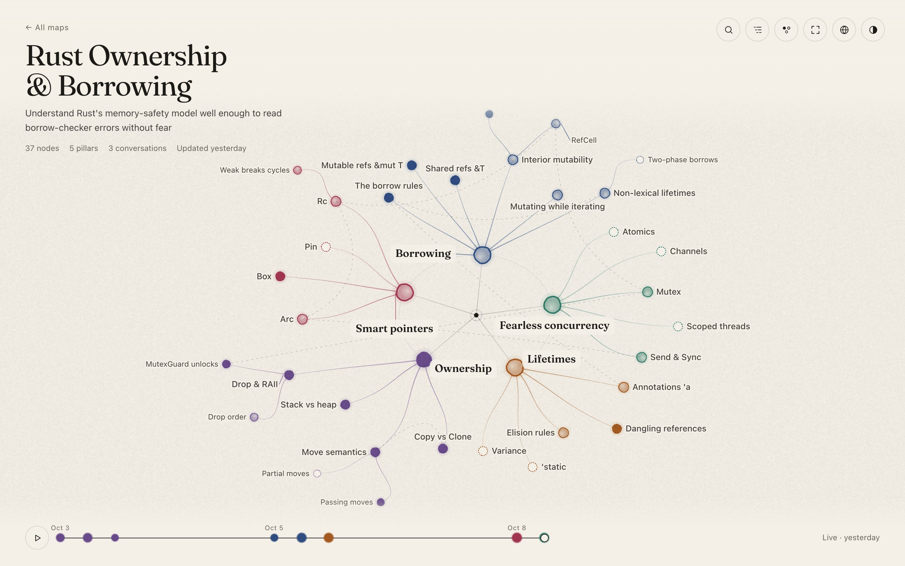
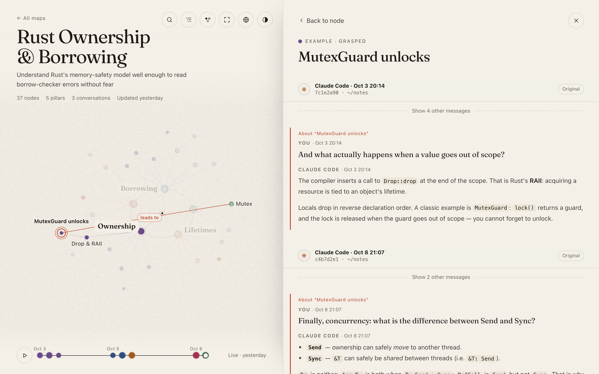
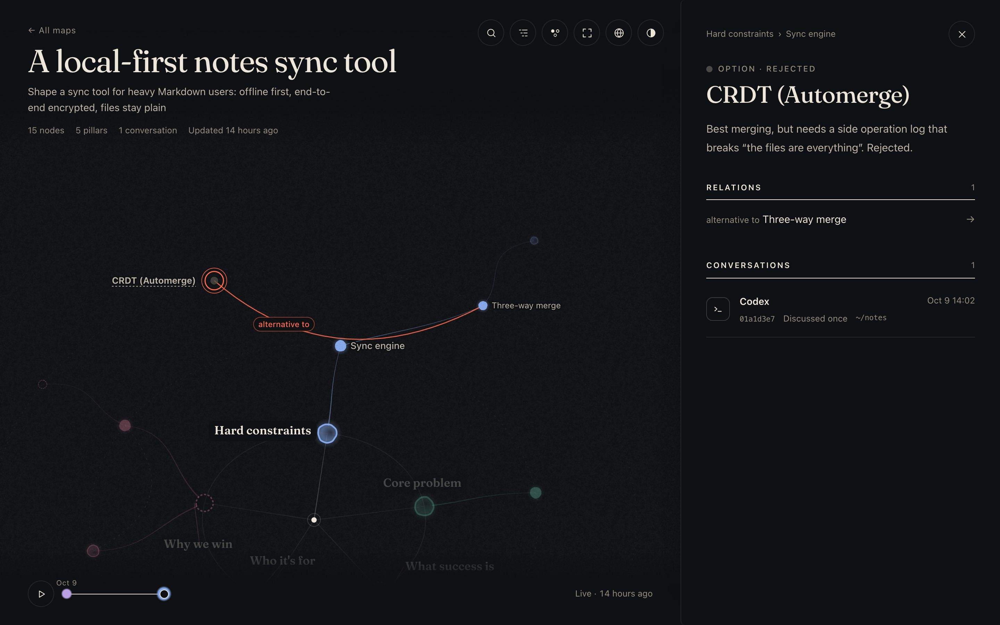

<h1 align="center">Efficient Coding</h1>

<p align="center">Agent skills, MCP config and small tools for working with coding agents like Claude Code and Codex.</p>

<p align="center">English · <a href="README_ZH.md">中文</a></p>

<p align="center">
  <a href="#featured-diffusion-maps">Diffusion Maps</a> ·
  <a href="#skills">Skills</a> ·
  <a href="#mcp-servers">MCP</a> ·
  <a href="#standards">Standards</a> ·
  <a href="#scripts--config">Scripts & config</a>
</p>

## Featured: Diffusion Maps

Learn a field or shape an idea across many conversations. The agent starts from a few **pillars**, then grows and restructures the map as you talk. Every node remembers the Claude Code or Codex conversation it came from, and a local viewer draws it all like ink spreading on paper.

<p align="center"></p>

<table>
  <tr>
    <td width="50%"></td>
    <td width="50%"></td>
  </tr>
  <tr>
    <td><sub><b>Back to the source.</b> Open a node to reread the conversations behind it, with the relevant turns marked.</sub></td>
    <td><sub><b>Not just learning.</b> Each map defines its own node kinds and statuses, so it can also shape a project or weigh a decision.</sub></td>
  </tr>
</table>

- **Grows with the conversation.** The agent decides when to add, merge, move or retire nodes, and asks only when unsure.
- **Picks up where you left off.** Maps live in `~/.efficient-coding/diffusion/`. Continue in any later session, in either agent, and delete the ones you no longer need from the index page.
- **Replayable.** The timeline replays how the map grew, one ink drop per moment of growth.
- **Zero setup.** Needs only Bun: no install, no build. The viewer stops by itself when idle.

```bash
bunx skills add https://github.com/jtsang4/efficient-coding --skill diffusion-map -g
```

Then invoke it explicitly with a topic, e.g. `/diffusion-map Rust ownership` in Claude Code or `$diffusion-map` in Codex. [How it works →](skills/diffusion-map/SKILL.md)

## Skills

Install any skill with `bunx skills add https://github.com/jtsang4/efficient-coding --skill <name>` (add `-g` for a global install). Name a skill in your request to force it.

**Plan and build.** By default, workflow comes first: `brainstorming` / `systematic-debugging` → `writing-plans` → `executing-plans` or `subagent-driven-development` → `test-driven-development` inside each task.

| Skill | Use it when |
| --- | --- |
| [`brainstorming`](skills/brainstorming/SKILL.md) | A feature or its requirements are still fuzzy; settle the design first. |
| [`shape`](skills/shape/SKILL.md) | A product idea needs clear decisions and a SPEC before any code. |
| [`problem-framing`](skills/problem-framing/SKILL.md) | A solution keeps growing exceptions or a discussion won't converge; test whether the problem itself is framed wrong. |
| [`agent-native-redesign`](skills/agent-native-redesign/SKILL.md) | You want to rethink a project or process assuming abundant agent and token budgets. |
| [`prove-it`](skills/prove-it/SKILL.md) | An idea sounds feasible but is unproven; freeze pass/kill criteria, then prove or refute it with runnable evidence. |
| [`writing-plans`](skills/writing-plans/SKILL.md) | The approach is decided; turn it into steps with verification. |
| [`executing-plans`](skills/executing-plans/SKILL.md) | Run a written plan in small batches with review checkpoints. |
| [`subagent-driven-development`](skills/subagent-driven-development/SKILL.md) | Run a plan in-session: one subagent per task, then spec and quality reviews. |
| [`test-driven-development`](skills/test-driven-development/SKILL.md) | Any feature, fix or refactor: red → green → refactor. |
| [`systematic-debugging`](skills/systematic-debugging/SKILL.md) | Bugs, flakes or "unexpected behaviour": find the root cause, add a failing test, then fix. |
| [`worktree-manager`](skills/worktree-manager/SKILL.md) | Create, switch, merge or remove worktrees via Worktrunk (`wt`) with guardrails. |
| [`merge-and-rebase`](skills/merge-and-rebase/SKILL.md) | A feature branch is done: commit, PR/MR, merge without squashing, rebase onto the new trunk. |
| [`prune`](skills/prune/SKILL.md) | Periodically slim an agent-built project without changing behavior: dead code, duplicates, unused features, needless abstraction, and the structure that keeps regrowing them. Invoke with no arguments; each run is logged in `docs/prune/`. |
| [`harness`](skills/harness/SKILL.md) | Make a codebase agent-friendly by extracting its engineering knowledge into structured context docs. |

**Learn and research.**

| Skill | Use it when |
| --- | --- |
| [`diffusion-map`](skills/diffusion-map/SKILL.md) | You want to learn a field or shape an idea across sessions as a growing, replayable map ([see above](#featured-diffusion-maps)). |
| [`assess-source-project-fit`](skills/assess-source-project-fit/SKILL.md) | You need to judge whether a paper, repo or talk offers anything your project lacks ("nothing worth adopting" is a valid answer). |
| [`exa-web-search`](skills/exa-web-search/SKILL.md) | You need current web, code or company information (free Exa MCP, no API key). |
| [`cubox-research`](skills/cubox-research/SKILL.md) | The answer should come from your Cubox collection; it searches broadly and stays read-only. Needs Bun and `.env`. |
| [`readwise-research`](skills/readwise-research/SKILL.md) | The answer should come from what you saved or highlighted in Readwise/Reader; it suggests actions before changing anything. |

**Integrate and automate.**

| Skill | Use it when |
| --- | --- |
| [`dev-browser`](skills/dev-browser/SKILL.md) | Navigate, click, fill forms, take screenshots, scrape, or test authenticated flows. |
| [`memos`](skills/memos/SKILL.md) | Work with the Memos API (memos, attachments, activities). Needs Bun and `.env` with `MEMOS_BASE_URL`, `MEMOS_ACCESS_TOKEN`. |
| [`paseo-relay`](skills/paseo-relay/SKILL.md) | Reach other Paseo hosts through authorized Relay pairing; read-only by default ([SDK reads](skills/paseo-relay/references/sdk.md)). |
| [`see`](skills/see/SKILL.md) | Short URLs, text sharing and file sharing through S.EE. |

**Author and extend.**

| Skill | Use it when |
| --- | --- |
| [`i-diagram`](skills/i-diagram/SKILL.md) | Draw an architecture, flow, sequence, state, mind-map or timeline diagram as one self-contained SVG with light and dark themes. |
| [`codex-skill-creator`](skills/codex-skill-creator/SKILL.md) | Create, improve, benchmark and package Codex skills with paired eval runs and human review. |
| [`use-remote-skill`](skills/use-remote-skill/SKILL.md) | Use a skill from another repo for one conversation, from an explicit source or a YAML catalog ([configuration](skills/use-remote-skill/references/configuration.md)). |

**External references** (bookmarks, not included here): [`impeccable`](https://github.com/pbakaus/impeccable) for frontend design critique and polish, and [`ui-ux-pro-max-skill`](https://github.com/nextlevelbuilder/ui-ux-pro-max-skill) for UI/UX prompts.

<details>
<summary>Skill sources</summary>

| Skill | Source repo | Local changes |
| --- | --- | --- |
| `brainstorming` | [`obra/superpowers`](https://github.com/obra/superpowers) | Worktree operations go through `worktree-manager` (copying the current working state). |
| `systematic-debugging` | [`obra/superpowers`](https://github.com/obra/superpowers) | Use `worktree-manager` when a repro needs its own worktree. |
| `writing-plans` | [`obra/superpowers`](https://github.com/obra/superpowers) | Worktree operations go through `worktree-manager` (copying the current working state). |
| `executing-plans` | [`obra/superpowers`](https://github.com/obra/superpowers) | |
| `subagent-driven-development` | [`obra/superpowers`](https://github.com/obra/superpowers) | |
| `test-driven-development` | [`obra/superpowers`](https://github.com/obra/superpowers) | |

</details>

## MCP Servers

| Server | Purpose | Command |
| --- | --- | --- |
| [fetcher-mcp](https://www.npmjs.com/package/fetcher-mcp) | Fetch web pages with a headless Playwright browser (stdio). | `bunx -y fetcher-mcp` |

Add it to your agent's MCP configuration; [`.mcp.json`](.mcp.json) is a generic example.

## Standards

Default engineering conventions recommended here. New ones are added as rows.

| Area | Applies to | Recommendation | Why |
| --- | --- | --- | --- |
| Project layout | Go services and apps | [`golang-standards/project-layout`](https://github.com/golang-standards/project-layout) | A good default for larger codebases (`cmd`, `internal`, `pkg`); keep small projects simple. |
| Project layout | Frontend apps | [Feature-Sliced Design](https://fsd.how/docs/get-started/overview/) | Layers plus business slices (`app`, `pages`, `features`, `entities`, `shared`) scale well. |
| Lint | Frontend / JS / TS | [Biome](https://biomejs.dev/linter/) | One fast formatter and linter; start from the recommended rules. |
| i18n | React | [`react-i18next`](https://github.com/i18next/react-i18next) | The standard in the i18next ecosystem: hooks, namespaces, interpolation, plurals. |
| i18n | Go | [`go-i18n`](https://github.com/nicksnyder/go-i18n) | Bundles plus locale files, plurals, template variables, extract/merge CLI. |

## Scripts & config

| Item | What it does | Usage |
| --- | --- | --- |
| [`install-autojump-rs.sh`](scripts/install-autojump-rs.sh) | Installs `autojump-rs` on macOS/Linux with `bash`/`zsh`/`fish` integration. | `bash scripts/install-autojump-rs.sh [--uninstall]` |
| Worktrunk "copy from base" hook | New worktrees start with the base worktree's current state, including git-ignored files like dependencies, `.env` and caches. Pairs with `worktree-manager`. | [`.config/wt.toml`](.config/wt.toml), [`scripts/wt-copy-from-base`](scripts/wt-copy-from-base) |

## License

MIT. See [`LICENSE`](LICENSE).
