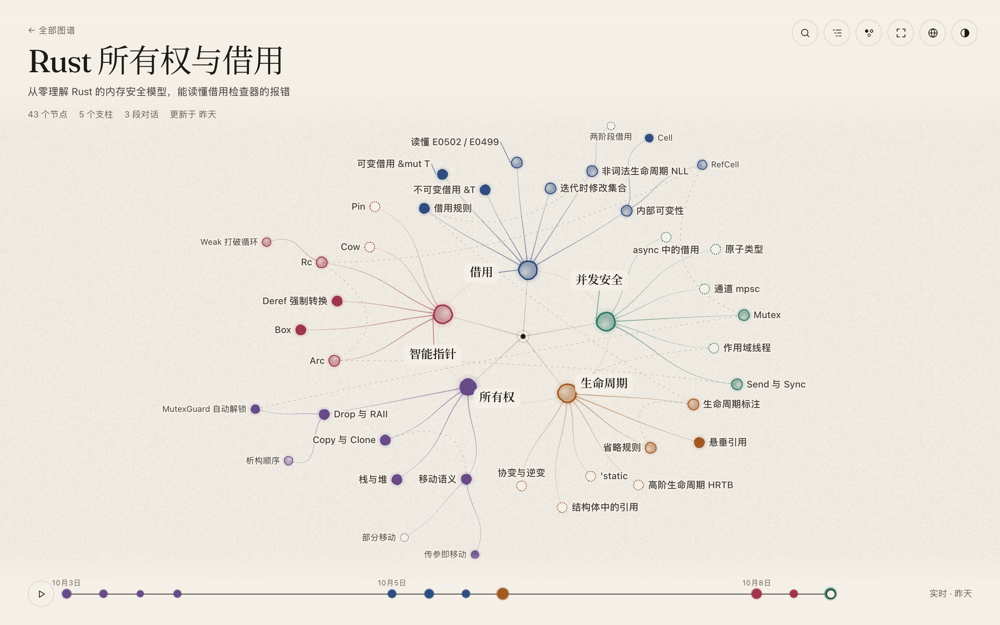
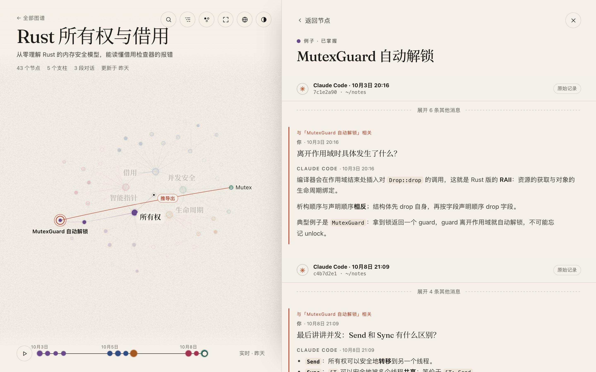
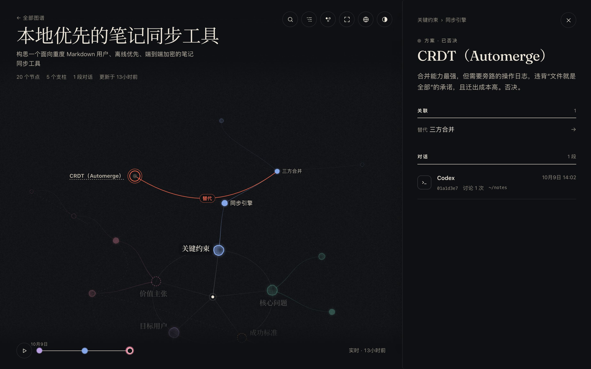

<h1 align="center">Efficient Coding（高效编码）</h1>

<p align="center">配合 Claude Code、Codex 等编程 Agent 使用的 skills、MCP 配置和小工具。</p>

<p align="center"><a href="README.md">English</a> · 中文</p>

<p align="center">
  <a href="#精选扩散图谱">扩散图谱</a> ·
  <a href="#skills">Skills</a> ·
  <a href="#mcp-servers">MCP</a> ·
  <a href="#工程规范">工程规范</a> ·
  <a href="#脚本与配置">脚本与配置</a>
</p>

## 精选：扩散图谱

跨越多次对话学一个领域，或者打磨一个构思。Agent 先确立几个**支柱**，再随着对话把图谱向外生长、重组。每个节点都记得它来自哪段 Claude Code 或 Codex 对话，本地网页把这一切画成在宣纸上晕开的墨迹。

<p align="center"></p>

<table>
  <tr>
    <td width="50%"></td>
    <td width="50%"></td>
  </tr>
  <tr>
    <td><sub><b>回到源头。</b>点开节点，就能重读它背后的对话，相关的轮次已经标出。</sub></td>
    <td><sub><b>不只是学习。</b>每张图自己定义节点类型和状态，也能用来构思项目、权衡决策。</sub></td>
  </tr>
</table>

- **随对话生长**：何时新增、合并、移动或搁置节点，由 Agent 自己判断，拿不准时才问你。
- **随时接着来**：图谱保存在 `~/.efficient-coding/diffusion/`，之后任何一次会话、两种 Agent 都能继续；不再需要的图谱可以在列表页直接删除。
- **可以回放**：时间轴按真实时间回放图谱的生长，每一次生长是一滴墨。
- **零配置**：只需要 Bun，不用装依赖、也不用构建；网页服务闲置后自动退出。

```bash
bunx skills add https://github.com/jtsang4/efficient-coding --skill diffusion-map -g
```

然后带上主题手动调用，例如在 Claude Code 里用 `/diffusion-map Rust 所有权`，在 Codex 里用 `$diffusion-map`。[了解工作方式 →](skills/diffusion-map/SKILL.md)

## Skills

安装任意 skill：`bunx skills add https://github.com/jtsang4/efficient-coding --skill <name>`（加 `-g` 全局安装）。在请求里点名某个 skill 即可强制使用它。

**规划与实现**：默认流程优先，`brainstorming` / `systematic-debugging` → `writing-plans` → `executing-plans` 或 `subagent-driven-development` → 每个任务内部用 `test-driven-development`。

| Skill | 什么时候用 |
| --- | --- |
| [`brainstorming`](skills/brainstorming/SKILL.md) | 新功能或需求还模糊：先把设计定下来。 |
| [`shape`](skills/shape/SKILL.md) | 编码前把产品想法梳理成清晰的决策和 SPEC。 |
| [`problem-framing`](skills/problem-framing/SKILL.md) | 方案不断长出特例或讨论不收敛：检查问题本身是不是定义错了。 |
| [`agent-native-redesign`](skills/agent-native-redesign/SKILL.md) | 假设 Agent 和 token 预算充裕，重新设计项目或流程。 |
| [`prove-it`](skills/prove-it/SKILL.md) | 想法听起来可行但没被证明：先冻结通过/击杀标准，再用可运行的证据证明或推翻。 |
| [`writing-plans`](skills/writing-plans/SKILL.md) | 方案已定：拆成带验证口径的执行步骤。 |
| [`executing-plans`](skills/executing-plans/SKILL.md) | 按计划分批执行，每批设检查点。 |
| [`subagent-driven-development`](skills/subagent-driven-development/SKILL.md) | 在当前会话按任务派发子 Agent，再做 spec 与质量两轮 review。 |
| [`test-driven-development`](skills/test-driven-development/SKILL.md) | 任何功能、修复或重构：Red → Green → Refactor。 |
| [`systematic-debugging`](skills/systematic-debugging/SKILL.md) | bug、不稳定的测试或"行为异常"：先找根因、补失败用例，再修。 |
| [`worktree-manager`](skills/worktree-manager/SKILL.md) | 用 Worktrunk（`wt`）创建、切换、合并、删除 worktree，带安全护栏。 |
| [`merge-and-rebase`](skills/merge-and-rebase/SKILL.md) | 特性分支收尾：提交、发 PR/MR、非 squash 合并，再 rebase 到最新主干。 |
| [`prune`](skills/prune/SKILL.md) | 定期给 Agent 开发的项目瘦身：在行为不变的前提下清掉死代码、重复实现、没人用的功能和过度抽象，并修正让它们反复长出来的结构。无需参数直接调用，每轮记录在 `docs/prune/`。 |
| [`harness`](skills/harness/SKILL.md) | 提取代码库的工程知识、生成结构化上下文文档，让项目更适合 Agent 协作。 |

**学习与研究**

| Skill | 什么时候用 |
| --- | --- |
| [`diffusion-map`](skills/diffusion-map/SKILL.md) | 想跨多次会话学一个领域或打磨构思，并留下可回放的图谱（[见上文](#精选扩散图谱)）。 |
| [`assess-source-project-fit`](skills/assess-source-project-fit/SKILL.md) | 判断一篇论文、一个仓库或一次分享是否真能补上项目的短板（"没有值得引入的"也是合法结论）。 |
| [`exa-web-search`](skills/exa-web-search/SKILL.md) | 需要最新的网页、代码或公司信息（免费的 Exa MCP，无需 API key）。 |
| [`cubox-research`](skills/cubox-research/SKILL.md) | 答案应该来自你的 Cubox 收藏：广泛检索、保持只读。需要 Bun 和 `.env`。 |
| [`readwise-research`](skills/readwise-research/SKILL.md) | 答案应该来自你在 Readwise/Reader 里存过、标注过的内容；改动前先给建议。 |

**集成与自动化**

| Skill | 什么时候用 |
| --- | --- |
| [`dev-browser`](skills/dev-browser/SKILL.md) | 页面导航、点击填表、截图、抓取，或测试登录态流程。 |
| [`memos`](skills/memos/SKILL.md) | 调用 Memos API（memos、附件、动态）。需要 Bun 和配置了 `MEMOS_BASE_URL`、`MEMOS_ACCESS_TOKEN` 的 `.env`。 |
| [`paseo-relay`](skills/paseo-relay/SKILL.md) | 通过已授权的 Relay 配对连接其它 Paseo host，默认只读（[SDK 读取](skills/paseo-relay/references/sdk.md)）。 |
| [`see`](skills/see/SKILL.md) | 通过 S.EE 生成短链、分享文本和文件。 |

**创作与扩展**

| Skill | 什么时候用 |
| --- | --- |
| [`i-diagram`](skills/i-diagram/SKILL.md) | 把架构、流程、时序、状态、思维导图或时间线画成单个自包含 SVG，支持明暗主题。 |
| [`codex-skill-creator`](skills/codex-skill-creator/SKILL.md) | 创建、改进、评测并打包 Codex skills，带成对 eval 和人工审阅。 |
| [`use-remote-skill`](skills/use-remote-skill/SKILL.md) | 在当前会话临时使用其它仓库的 skill，来源可以是明确地址或 YAML 目录（[配置说明](skills/use-remote-skill/references/configuration.md)）。 |

**外部参考**（仅收藏，未内置）：[`impeccable`](https://github.com/pbakaus/impeccable)，用于前端设计审查与润色；[`ui-ux-pro-max-skill`](https://github.com/nextlevelbuilder/ui-ux-pro-max-skill)，UI/UX 提示词参考。

<details>
<summary>Skill 来源</summary>

| Skill | 来源仓库 | 本地改动 |
| --- | --- | --- |
| `brainstorming` | [`obra/superpowers`](https://github.com/obra/superpowers) | worktree 操作统一交给 `worktree-manager`（复制当前工作状态）。 |
| `systematic-debugging` | [`obra/superpowers`](https://github.com/obra/superpowers) | 需要单独 worktree 隔离复现时，用 `worktree-manager`。 |
| `writing-plans` | [`obra/superpowers`](https://github.com/obra/superpowers) | worktree 操作统一交给 `worktree-manager`（复制当前工作状态）。 |
| `executing-plans` | [`obra/superpowers`](https://github.com/obra/superpowers) | |
| `subagent-driven-development` | [`obra/superpowers`](https://github.com/obra/superpowers) | |
| `test-driven-development` | [`obra/superpowers`](https://github.com/obra/superpowers) | |

</details>

## MCP Servers

| 服务 | 用途 | 命令 |
| --- | --- | --- |
| [fetcher-mcp](https://www.npmjs.com/package/fetcher-mcp) | 用 Playwright 无头浏览器抓取网页（stdio）。 | `bunx -y fetcher-mcp` |

把它加到所用 Agent 的 MCP 配置里即可，通用示例见 [`.mcp.json`](.mcp.json)。

## 工程规范

本仓库推荐的默认工程规范，新增规范直接追加一行。

| 领域 | 适用范围 | 推荐方案 | 理由 |
| --- | --- | --- | --- |
| 项目结构 | Go 服务 / 应用 | [`golang-standards/project-layout`](https://github.com/golang-standards/project-layout) | 适合中大型项目（`cmd`、`internal`、`pkg`）；小项目保持简单更重要。 |
| 项目结构 | 前端应用 | [Feature-Sliced Design](https://fsd.how/docs/get-started/overview/) | 分层加业务切片（`app`、`pages`、`features`、`entities`、`shared`），易于扩展。 |
| Lint | 前端 / JS / TS | [Biome](https://biomejs.dev/linter/) | 格式化与 lint 合一、速度快；从推荐规则起步。 |
| i18n | React | [`react-i18next`](https://github.com/i18next/react-i18next) | i18next 生态的标准选择：hooks、命名空间、插值、复数。 |
| i18n | Go | [`go-i18n`](https://github.com/nicksnyder/go-i18n) | bundle 加 locale 文件，支持复数、模板变量和 extract/merge CLI。 |

## 脚本与配置

| 项目 | 作用 | 用法 |
| --- | --- | --- |
| [`install-autojump-rs.sh`](scripts/install-autojump-rs.sh) | 在 macOS/Linux 安装 `autojump-rs`，并集成 `bash`/`zsh`/`fish`。 | `bash scripts/install-autojump-rs.sh [--uninstall]` |
| Worktrunk "copy from base" hook | 新建 worktree 时带上 base worktree 的当前状态，包括依赖、`.env`、缓存等被 git 忽略的文件。适合搭配 `worktree-manager`。 | [`.config/wt.toml`](.config/wt.toml)、[`scripts/wt-copy-from-base`](scripts/wt-copy-from-base) |

## License

MIT 协议，详见 [`LICENSE`](LICENSE)。
